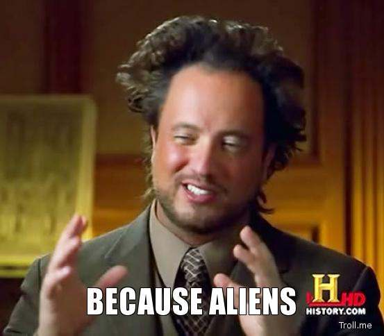

=============

 # Why?  Because Aliens.

 becausealiens is a package for investigating the data from [The National UFO Reporting Center](http://www.nuforc.org).  Initially, it will download the data, and assign some text analytic metrics to each report saved to a MongoDB collection.
